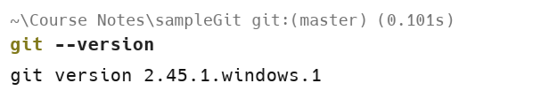

# Snapshots

1. Git version check :

1. Git configuration commands :

1. Git initialisation

1. Tracking changes of file using Git status

1. Staging file for commit

1. Commit the staged file

1. Seeing the Commit history

1. Creating and viewing branches

1. Using Git checkout command to switch branches

1. Merging a branch with the master branch

1. Adding a remote repo to local and pushing contents of local to the remote repository

1. Git fetch to see changes

1. Git diff command :

 

1. Using Git pull directly

1. Pulling branch from GitHub

1. Seeing local and remote branches 

1. GitHub snapshot of changes done to a branch

1. Reviewing the changes by raising a pull request

1. Merging the pull request

