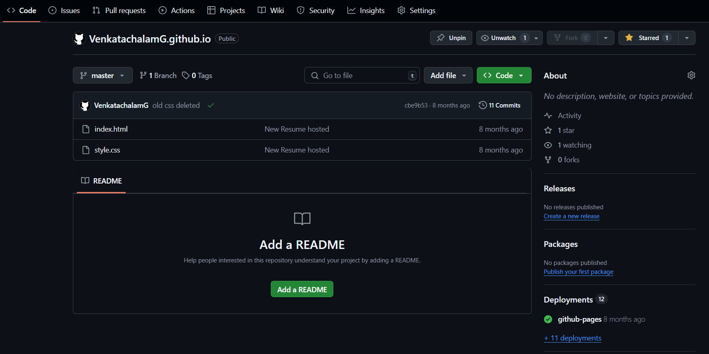
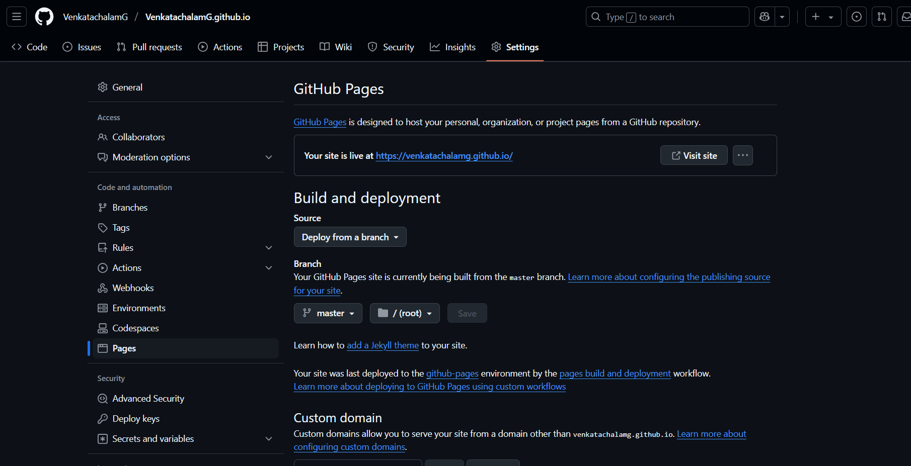

# Git Notes

# Check Git Version

#version The below command is used to check the version of **Git installed :** 

```bash
git --version
```

Snapshot : [image.png](https://www.notion.so/1e15d5288e8980ff8673c12524debd32?pvs=21) 

Note : The terminal used to practice **Git** commands is **Warp Terminal**

# Configuring Git

#configure The command to configure a user in Git is shown below :

```bash
git config --global user.name "username"
git config --global user.email "user_email"
```

Snapshot : [image.png](https://www.notion.so/1e15d5288e8980f7b458d0ad7ebc42d4?pvs=21) 

# Initialise Git Repository

#init To **initialise** a git repository inside a folder use the below command :

```bash
git init
```

Snapshot : [image.png](https://www.notion.so/1e15d5288e89809e9332fb9fe8490aaa?pvs=21) 

# Tracking Changes to a file in git folder

#track To **track changes** of files in a git folder use the below command :

```bash
git status
```

Snapshot : [image.png](https://www.notion.so/1e15d5288e898038b976f7e26f192dd2?pvs=21) 

# Staging the file

#add To **stage** a file for commit use the below command :

```bash
git add <filename> (or . for all files)
```

Snapshot : [image.png](https://www.notion.so/1e15d5288e8980848303fe239793cb40?pvs=21) 

# Committing the file

#commit To **commit** the staged file use the following command(s)

```bash
git commit -m "Your message"  //generally used

git commit -a -m "Your message" // to commit even the smallest of changes
```

Snapshot :  [image.png](https://www.notion.so/1e15d5288e898051895bfc05ad8fa11e?pvs=21) 

- Note :  To see log history use the command below :
    
    ```bash
    git log
    ```
    
    Snapshot : [image.png](https://www.notion.so/1e15d5288e89801482cac80fa911784b?pvs=21) 
    

# Git Branch

#branch To **create** a new branch and **view** which branch we are on use the below commands

```bash
git branch <branch-name> //to create a new branch

git branch //shows the branches and on which branch you are on currently 
						 (has a '*' before the branch name)
```

Snapshot : [image.png](https://www.notion.so/1e25d5288e8980f18e5bd4858a14a5b6?pvs=21) 

#checkout To **switch** branches use the checkout command as shown below :

```bash
git checkout <branch-name>
```

Snapshots : [image.png](https://www.notion.so/1e25d5288e89808d999cddd471bb5c84?pvs=21) \

Note : To automatically create a branch during checkout use **-b**. It will create new branch if it doesn’t already exist. The command is as shown below :

```bash
git checkout -b <branch-name>
```

# Git Delete Branch

#delete To delete a git branch use the following command :

```bash
git branch -d <branch-name> // -d is crucial
```

# Git Merge

#merge To **merge** a branch to the **master/main** branch, first **switch** to the main branch and then execute the command below :

```bash
git merge <branch-name> // the branch-name should be the name of the branch you want to merge
													 with the main branch
```

Snapshot : [image.png](https://www.notion.so/1e25d5288e898084a158c07ef5a07c99?pvs=21) 

# Pushing Local Changes To Remote Repo

#push To push the local repo/ its changes to a remote repository do the following :

```bash
git remote add origin <url> // this adds the remote repo at 'url' as origin

git push origin master //push the contents of local to origin and to master branch
													(master could be any other branch name too)
```

Note : For first time push its a good practice to use git push --set-upstream as it establishes a link between the local and the remote repositories

```bash
git push --set-upstream origin <branch-name>
```

Snapshot : [image.png](https://www.notion.so/1e25d5288e8980d6ba6af8cf4721c41d?pvs=21) 

# Git Pull

#manual-pull We use Git pull to **pull changes made / latest version** to/ of a **remote repository** so that we can work on it in our **local**. Pull contains 2 commands : **Fetch and Merge**

### Git Fetch

#fetch Fetch tracks all changes made to a branch/repo. The command to use fetch is as follows :

```bash
git fetch origin
```

Snapshot : [image.png](https://www.notion.so/1e25d5288e89804591bbe2cf9c737b42?pvs=21) 

### Git Merge

#pull You can manually merge after using fetch and git diff to see the changes/ version difference between 2 repos by using the git diff as shown below :

```bash
git diff <branch-name>

git merge <branch-name>
```

Snapshot : [image.png](https://www.notion.so/1e25d5288e898061b29ac18e20fbc4b2?pvs=21) 

#direct-pull Instead of doing the above we can pull the changes by directly using the git pull command as shown below :

```bash
git pull origin <branch-name>
						(or)
git pull origin						
```

Snapshot : [image.png](https://www.notion.so/1e25d5288e8980298e92c3322dc3f88e?pvs=21) 

# Pull Branch from GitHub

#pull-branch To **pull a branch created on github** to the **loca**l just use git pull

Snapshot : [image.png](https://www.notion.so/1e25d5288e8980feaa19d66244c5ae6c?pvs=21) 

Notice that we **cannot see the pulled remote branches** on using git branch. To see them use the below commands :

```bash
git branch -a //shows all local and remote branches

git branch -r //shows only remote branches
```

Snapshot : [image.png](https://www.notion.so/1e25d5288e89800cba2ffa3148fa01c4?pvs=21) 

# Pushing Branch to Github

#push-branch To **push** the branch from a **local repo** onto the **remote** repository use **git push**

```bash
git push <branch_name> origin
```

To see the process of pull request and merge request refer to the snapshot below :

Snapshot of Pull Request : [image.png](https://www.notion.so/1e25d5288e8980c0b2b8e1224cc4495b?pvs=21) 

Snapshot of Merge Request : [image.png](https://www.notion.so/1e25d5288e8980e8a314f75c5b618f96?pvs=21)  

# GitHub Pages

#pages Github Pages lets you publish a website directly from your repository.

Below is the pic of a **sample git repo** created for **github pages**



The commands for the creation of a git repo and uploading required files in the repository as follows:

```bash
git remote add origin https://github.com/your-username/your-username.github.io.git
git push -u origin master
```

The pages for your repository can be viewed in the **Pages** section in **Settings**



**Note :** The link in the “Your site is live at” can be clicked to view your page